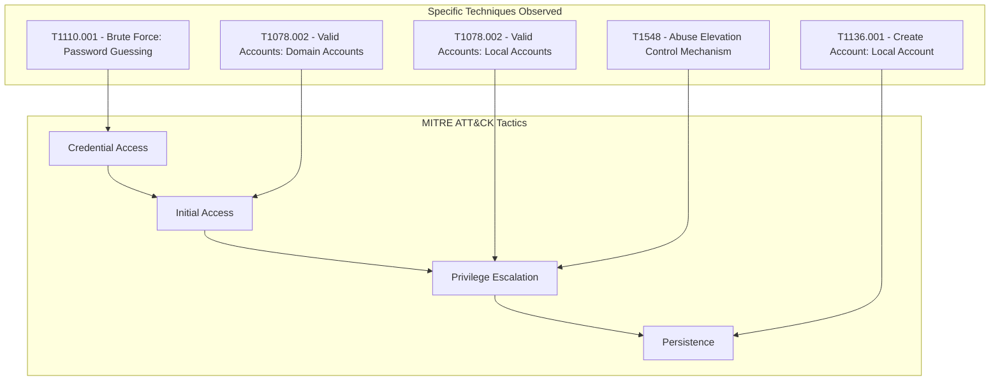

# 🎯 MITRE ATT&CK Mapping & Proactive Detection Engineering

This document maps the adversary's technical behavior to the globally recognized **MITRE ATT&CK Framework** and details the production-ready **Splunk Search Processing Language (SPL)** alert definitions designed to detect these techniques at an early stage.

---

## 🗺️ MITRE ATT&CK Matrix Mapping

By aligning the observed security events to specific tactics and techniques, security engineers can identify detection gaps and plan defensive postures.



### Technical Mapping Breakdown

| Tactic | Technique ID | Technique Name | Observed Event Evidence | Forensic Explanation |
| :--- | :--- | :--- | :--- | :--- |
| **🔑 Credential Access** | `T1110.001` | Brute Force: Password Guessing | EventID `4625` (Wrong Password / Unknown Username) | External IP `185.220.101.47` performed 30 rapid failed login attempts targeting multiple accounts (`administrator`, `john.smith`, etc.). |
| **🛡️ Defense Evasion** | `T1078.002` | Valid Accounts: Domain Accounts | EventID `4740` (Account Lockout) | AD automatically locked out `administrator` and `john.smith` to block brute force, indicating the adversary triggered active defenses. |
| **🔓 Initial Access** | `T1078.002` | Valid Accounts: Domain Accounts | EventID `4624` (Logon Success - Network) | The adversary successfully authenticated as `administrator` from `185.220.101.47`, bypassing the external boundary. |
| **📈 Privilege Escalation** | `T1078.002` / `T1548` | Valid Accounts / Abuse Elevation Control | EventID `4672` (Special Privileges Assigned) | System automatically mapped administrative tokens (`SeDebugPrivilege`, `SeLoadDriverPrivilege`, etc.) to the attacker's network session. |
| **⏳ Persistence** | `T1136.001` | Create Account: Local Account | EventID `4688` (`net user hacker P@ss123 /add`) | Attacker executed commands to spawn a permanent backdoor account named `hacker` directly on the Domain Controller. |
| **📈 Privilege Escalation** | `T1078.002` | Valid Accounts: Local Accounts | EventID `4688` (`net localgroup administrators hacker /add`) | Attacker assigned domain-level administrative credentials to the `hacker` backdoor account. |

---

## 🛠️ Proactive Detection Engineering (Production SPL Alerts)

To ensure early warning detection of similar techniques, security teams must deploy the following Splunk SIEM alert correlation searches:

### 1. Alert: High-Frequency Brute Force Detection (Credential Access)
* **Goal:** Detect automated password guessing before a successful logon occurs.
* **SPL Query:**
  ```spl
  index=corp_logs EventID=4625
  | stats count, dc(User) as targeted_users, values(User) as user_list by IP_Address, Computer
  | where count >= 10
  ```
* **Alert Trigger Conditions:** Run every 5 minutes. Trigger if the search returns any results (Threshold: $\ge 10$ failed attempts from a single IP within 5 minutes).
* **Severity:** 🟡 MEDIUM

### 2. Alert: Security Principal Lockout (Defense Evasion / Attack Signal)
* **Goal:** Alert the SOC when accounts are locked out due to password thresholds, indicating an active attack.
* **SPL Query:**
  ```spl
  index=corp_logs EventID=4740
  | table _time, Computer, User, Description
  ```
* **Alert Trigger Conditions:** Real-time alert. Trigger immediately on every occurrence.
* **Severity:** 🟡 MEDIUM

### 3. Alert: Successful Administrative Network Logon from External Source
* **Goal:** Detect when high-privileged accounts log in via network (LogonType 3) from non-standard or external IPs.
* **SPL Query:**
  ```spl
  index=corp_logs EventID=4624 LogonType=3 (User=administrator OR User=admin)
  | rx_block_ip="192.168.*"  ``` *Note: Filter out corporate IP blocks.*
* **Alert Trigger Conditions:** Real-time alert. Trigger immediately on any logon from an external subnet.
* **Severity:** 🔴 HIGH

### 4. Alert: Rogue Local Account Creation (Persistence)
* **Goal:** Detect unauthorized local users created using cmd/PowerShell.
* **SPL Query:**
  ```spl
  index=corp_logs EventID=4688 Description="*net*user*/add*"
  | table _time, Computer, User, Description
  ```
* **Alert Trigger Conditions:** Real-time alert. Trigger immediately on command match.
* **Severity:** 🔴 CRITICAL

### 5. Alert: High-Privilege Group Membership Modification (Privilege Escalation)
* **Goal:** Detect when any account is added to the `administrators` local or domain group.
* **SPL Query:**
  ```spl
  index=corp_logs EventID=4688 Description="*net*localgroup*administrators*/add*"
  | table _time, Computer, User, Description
  ```
* **Alert Trigger Conditions:** Real-time alert. Trigger immediately on command match.
* **Severity:** 🔴 CRITICAL
