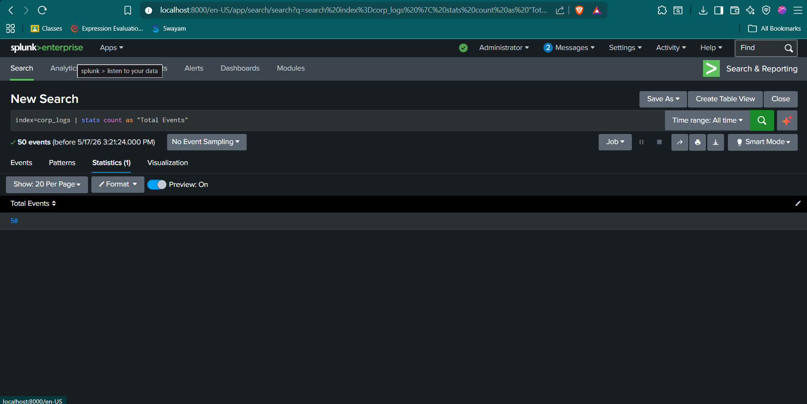
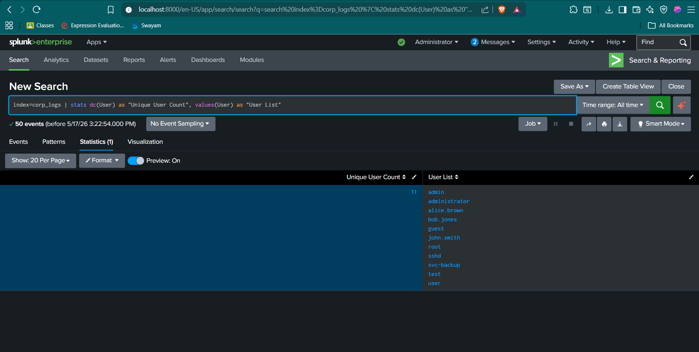
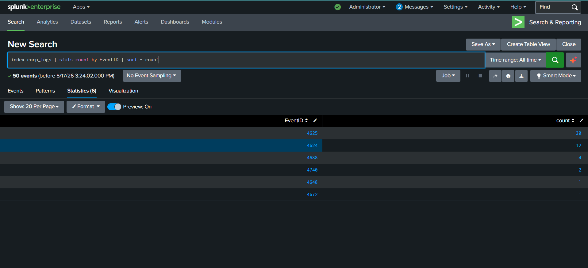
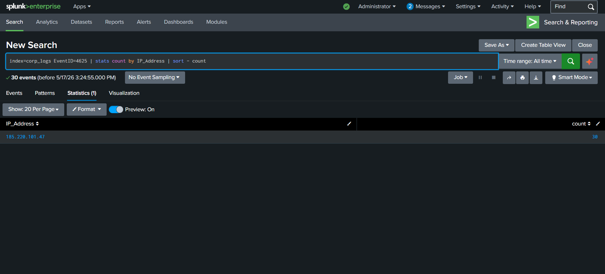
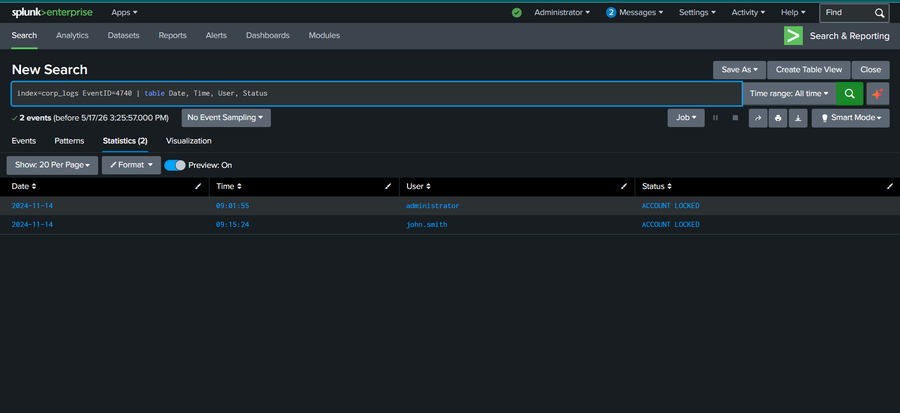
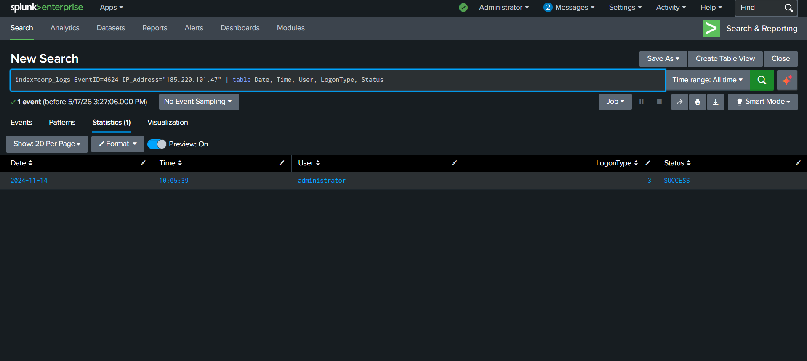
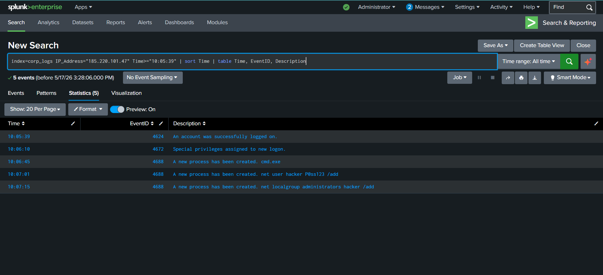

# 🔍 Splunk Enterprise Forensic Investigation Walkthrough

This document outlines the step-by-step forensic investigation conducted using **Splunk Enterprise** to analyze Windows Security Event logs and reconstruct the compromise of the Domain Controller (`CORP-DC01`).

---

## 📥 Phase 1: Ingestion & Data Exploration

### 1. Verification of Data Ingestion Scope
**Forensic Question:** *How many total events are in the log file?*

To verify that the dataset was fully ingested and to establish our baseline event volume, we execute an initial count search:

```spl
index=corp_logs | stats count as "Total Events"
```

* **Findings:** There are exactly **50 total events** recorded in the ingested log file.
* **Forensic Value:** This relatively small dataset represents a targeted, high-fidelity window into a specific compromise timeline on `CORP-DC01`.


*Figure 1: Baseline search validating ingestion of exactly 50 security log events.*

---

### 2. User & Target Space Reconnaissance
**Forensic Question:** *How many unique users appear in the logs?*

We want to understand which identities are active or targeted within the security logs to map the perimeter of the threat space:

```spl
index=corp_logs | stats dc(User) as "Unique User Count", values(User) as "User List"
```

* **Findings:** There are **11 unique user identities** that appear in the logs:
  - `admin`, `administrator`, `alice.brown`, `bob.jones`, `guest`, `john.smith`, `root`, `sshd`, `svc-backup`, `test`, `user`.
* **Forensic Value:** This broad list includes standard domain users (`alice.brown`, `bob.jones`, `john.smith`), service accounts (`svc-backup`), and common system admin defaults (`administrator`, `admin`, `root`, `sshd`), suggesting potential username harvesting or password spraying.


*Figure 2: Splunk results listing the distinct identities appearing within the dataset.*

---

### 3. Event Type Profile Breakdown
**Forensic Question:** *How many EventID types are present? List them.*

Analyzing the distribution of Event IDs helps determine the primary activity types in the dataset (e.g., successes, failures, account lockouts, process creations):

```spl
index=corp_logs | stats count by EventID | sort - count
```

* **Findings:** There are **6 distinct Event IDs** present, categorized as follows:
  1. **EventID 4625** (30 occurrences) - *An account failed to log on (Failed Logon)*
  2. **EventID 4624** (12 occurrences) - *An account was successfully logged on (Successful Logon)*
  3. **EventID 4688** (4 occurrences) - *A new process has been created (Process Creation)*
  4. **EventID 4740** (2 occurrences) - *A user account was locked out (Account Lockout)*
  5. **EventID 4648** (1 occurrence) - *A logon was attempted using explicit credentials*
  6. **EventID 4672** (1 occurrence) - *Special privileges assigned to new logon*


*Figure 3: Event ID distribution illustrating a heavy skew towards Logon Failures (4625).*

---

## 🚨 Phase 2: Anomaly Detection & Threat Mapping

### 1. Identifying the Threat Source
**Forensic Question:** *Which IP address stands out as suspicious? Why?*

To isolate the source of the anomaly, we perform a count of logon failures (EventID 4625) aggregated by their source IP address:

```spl
index=corp_logs EventID=4625 | stats count by IP_Address | sort - count
```

* **Findings:** The external IP **`185.220.101.47`** stands out immediately.
* **Why it is suspicious:**
  - It is responsible for **100% of all failed logons** (30 attempts).
  - The IP represents a public, external netblock attempting high-volume authentications directly against a critical internal Active Directory Domain Controller (`CORP-DC01`).
  - *Threat Intelligence Note:* Public lists flag this IP range as a Tor Exit Node, which is commonly leveraged by adversaries to mask their origin.


*Figure 4: Core anomaly search identifying 185.220.101.47 as the lone source of all failed logon attempts.*

---

### 2. Attacker Target Matrix
**Forensic Question:** *Which accounts were targeted by the suspicious IP?*

To determine whether the adversary was performing a targeted brute-force or a broad password-spray attack, we cross-tabulate the malicious IP against targeted user accounts:

```spl
index=corp_logs IP_Address=185.220.101.47 EventID=4625 | stats count by User | sort - count
```

| Targeted User | Failed Attempts (Event ID 4625) | Result / Impact |
| :--- | :---: | :--- |
| **`administrator`** | 13 | Primary target, locked out, then compromised |
| **`john.smith`** | 5 | Secondary target, locked out |
| **`root`** | 3 | Generic credential guess |
| **`admin`** | 3 | Generic credential guess |
| **`user`** | 2 | Generic credential guess |
| **`test`** | 2 | Generic credential guess |
| **`sshd`** | 1 | Generic credential guess |
| **`guest`** | 1 | Generic credential guess (Disabled) |

* **Forensic Analysis:** The attacker utilized a hybrid attack pattern. They performed password spraying against default templates (`root`, `admin`, `guest`) to discover active accounts, and then pivoted to rapid brute-forcing against discovered users (`administrator` and `john.smith`).

---

### 3. Active Directory Account Lockout Incidents
**Forensic Question:** *Were any accounts locked out? Which EventID tells you this?*

We monitor Active Directory safety triggers to identify accounts that reached their invalid password threshold:

```spl
index=corp_logs EventID=4740 | table Time, User, IP_Address, Description
```

* **Findings:** Two critical accounts were locked out due to the brute-force attack:
  - **`administrator`** at **09:01:55 AM**
  - **`john.smith`** at **09:15:24 AM**
* **Forensic Value:** The lockouts occurred shortly after the initial burst of failures, confirming that standard Active Directory domain security policies were triggered by `185.220.101.47`.


*Figure 5: Security log entries mapping the account lockout events triggered on CORP-DC01.*

---

### 4. The Successful Compromise (The Breach)
**Forensic Question:** *Did the attacker eventually succeed in logging in? How can you tell?*

A successful logon (EventID 4624) originating from the malicious external IP indicates a full system breach:

```spl
index=corp_logs IP_Address=185.220.101.47 EventID=4624 | table Time, User, LogonType, Status
```

* **Findings:** **Yes, the breach was successful.**
* **Forensic Proof:** At **10:05:39 AM**, an EventID `4624` (Successful Logon) occurred for the primary **`administrator`** account, originating from the malicious IP `185.220.101.47` (Logon Type 3 - Network).
* **Escalation Indicator:** Immediately following at **10:06:10 AM**, Event ID `4672` (Special Privileges Assigned to New Logon) was logged for the session, granting the attacker full administrative and debug rights on the system.


*Figure 6: Splunk search capturing the exact moment of successful compromise and privilege escalation.*

---

## ☣️ Phase 3: Post-Compromise Shell Analysis

### 1. Attacker Command Reconstruction
**Forensic Question:** *What commands were run on the system after compromise?*

By isolating process creation events (Event ID 4688) associated with the compromised logon session, we reconstruct the threat actor's command history:

```spl
index=corp_logs EventID=4688 | table Time, User, Description, IP_Address
```

* **Findings:** The attacker launched a shell and executed two highly critical commands:
  1. **`cmd.exe`** (10:06:45 AM) - Established an interactive command prompt.
  2. **`net user hacker P@ss123 /add`** (10:07:01 AM) - Created a new local user account named `hacker`.
  3. **`net localgroup administrators hacker /add`** (10:07:15 AM) - Added the new `hacker` account to the local Administrators group.


*Figure 7: Command-line audit trails capturing the malicious user creation and privilege group modification.*

### 2. Goal of Post-Compromise Activity
The attacker's actions represent two classic post-compromise tactics under the MITRE ATT&CK Framework:
* **Persistence (TA0003) via Local Account Creation (T1136.001):** By creating a new, separate user account (`hacker`), the attacker ensured they could retain access even if the hijacked primary `administrator` credentials were changed or if the administrator account was locked again.
* **Privilege Escalation (TA0004) via Domain/Local Group Modification (T1078.002):** Elevating the `hacker` account directly into the `administrators` group granted them permanent, administrative control over the Domain Controller `CORP-DC01`.
